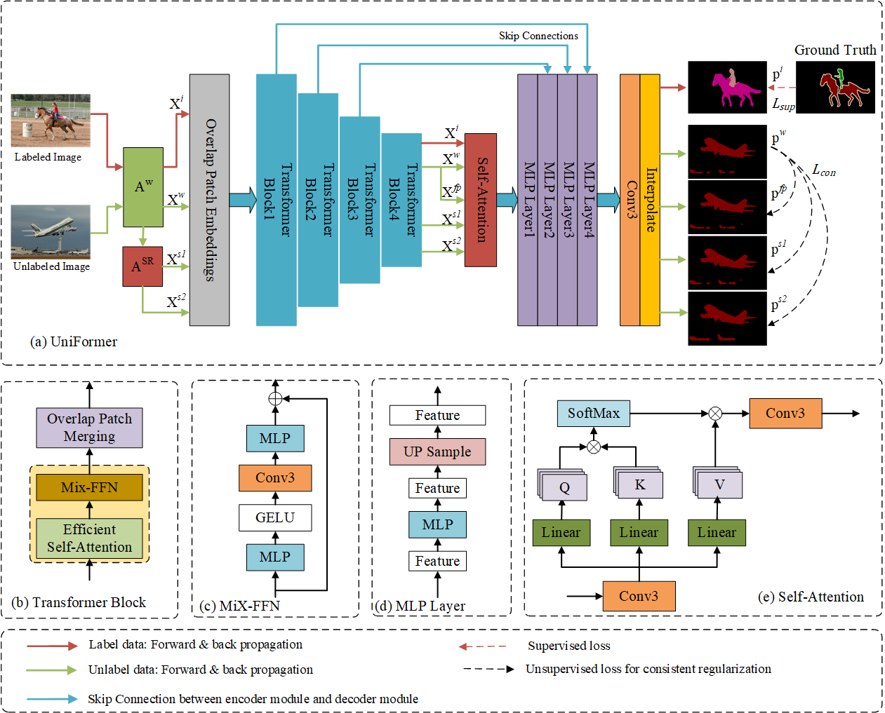

# UniFormer

- Consistency Regularization-based Semi-supervised Semantic Segmentation via Differential Dual-branch Strongly Augmented Perturbations

# Network Architecture




### 1. Environment

- Create a new environment and install the requirements:

```shell
conda create -n UniFormer python=3.8
conda activate UniFormer
conda install pytorch==1.13.0 torchvision==0.14.0 torchaudio==0.13.0 pytorch-cuda=11.6 -c pytorch -c nvidia
pip install tensorboard
pip install six
pip install pyyaml
pip install -U openmim
pip install mmcv==1.6.2
pip install einops
pip install timm
pip install scipy
```


### 2. Data Preparation

- Pascal: [JPEGImages](http://host.robots.ox.ac.uk/pascal/VOC/voc2012/VOCtrainval_11-May-2012.tar) | [SegmentationClass](https://drive.google.com/file/d/1ikrDlsai5QSf2GiSUR3f8PZUzyTubcuF/view?usp=sharing)
- Cityscapes: [leftImg8bit](https://www.cityscapes-dataset.com/file-handling/?packageID=3) | [gtFine](https://drive.google.com/file/d/1E_27g9tuHm6baBqcA7jct_jqcGA89QPm/view?usp=sharing)
- COCO: [train2017](http://images.cocodataset.org/zips/train2017.zip) | [val2017](http://images.cocodataset.org/zips/val2017.zip) | [masks](https://drive.google.com/file/d/166xLerzEEIbU7Mt1UGut-3-VN41FMUb1/view?usp=sharing)
- 
  Then your file structure will be like:


```
├── VOC2012
    ├── JPEGImages
    └── SegmentationClass
    
├── cityscapes
    ├── leftImg8bit
    └── gtFine
    
├── coco
    ├── train2017
    ├── val2017
    └── masks
```


### 3.Pre-trained Weights

- Next, download the following [pretrained weights](https://pan.baidu.com/s/1Q_klUFq5Im0WGPfbvgbgPw 
  提取码：spe2).

```
├── ./pretrained_weights
    ├── mit_b2.pth
    ├── mit_b3.pth
    ├── mit_b4.pth
    └── mit_b5.pth
```


### 4. Training & Evaluating

```bash
sh scripts/train.sh <num_gpu> <port>
```

To train on other datasets or splits, please modify
``dataset`` and ``split`` in ``train.sh``.


